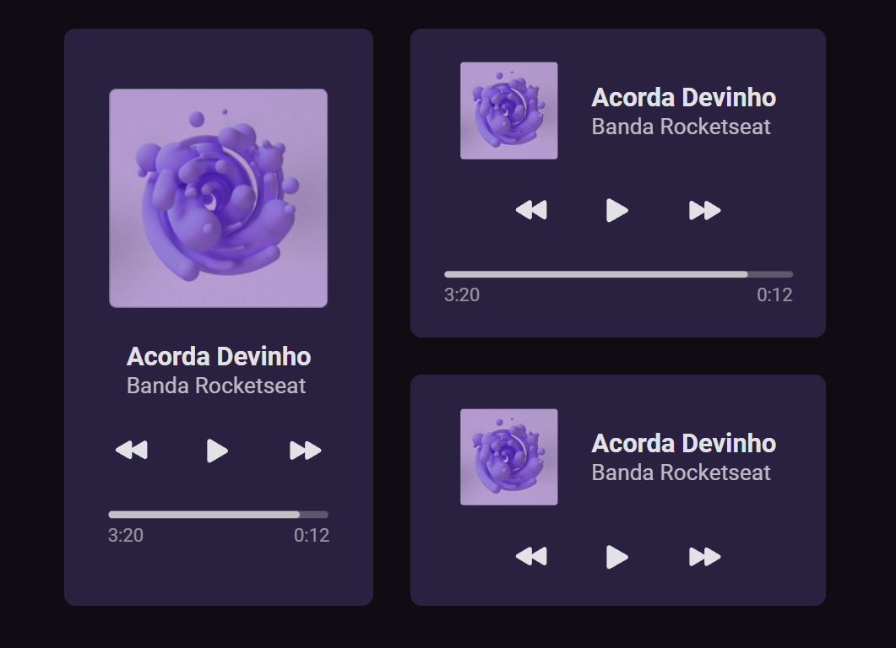

# Music Player [🔗Clique para acessar o projeto](https://melovitormusicplayer.netlify.app/)

# > Desafio #BoraCodar - 1.

Projeto criado atráves do desafio de FrontEnd lançado pela @Rocketseat utilizando o projeto do figma lançado por eles

## 🛠️ Tecnologias.

- React.js
- Css
- Vite  
- TypeScript
- Git e Github

## 💜 Contato.

vitormelobatista@gmail.com  

## 🎨 Figma.

https://www.figma.com/file/r2aKi3ORmtWGOweIJDZG6x/%23boraCodar---Desafio-1-(Copy)?node-id=0%3A1&t=SjhgWR7LQ5C7Dn4x-0
